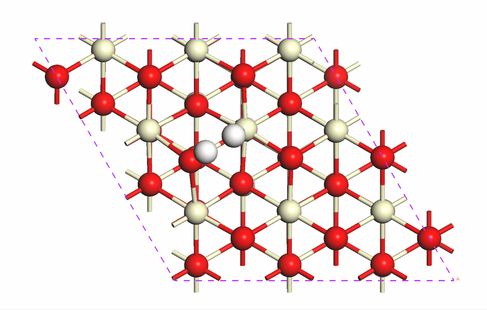

# Material Studio 软件教程

## 文件可视化

由于 MS 一些特定后缀的文件需要一些额外的操作才可进行可视化，故在此进行简要的介绍。

### 轨迹文件（\*.arc）

arc 文件记录了原子结构变化的轨迹信息，其详细文件格式可参看 MS 提供的离线手册，下面分步骤讲述如何查看 arc 文件的轨迹信息（以 CeO$_2$(111) 表面 H$_2$ 解离过渡态的振动轨迹为例，文件可在<a href="freq12.arc" target="_blank">此处</a>下载）。

1. 将 arc 文件拖到 MS 软件中，并根据个人习惯进行结构的调整；

```{image} freq1.png
:width: 500
:align: center
```

2. 初次导入 arc 文件时，需要将动画工具显示在工具栏处，选择 View-Toolbars-Animation 即可实现；

```{image} freq2.png
:width: 500
:align: center
```

3. 完成第二步时，便可在工具栏处找到`动画`相关的按钮选项，如上图红框所示；

4. 点击播放按钮，结构自己就会按照轨迹的运动方向循环播放，至此便完成了 arc 文件的查看。

<div align=center></div>

### 电荷密度文件（\*.grd）

grd 文件记录了电荷密度的信息，其详细文件格式可参看 MS 提供的离线手册，下面分步骤讲述如何查看 grd 文件的轨迹信息（以 CeO$_2$(111) 表面 H 吸附的模型为例）。

1. 导入已经优化好的 xsd 文件；

```{image} grd1.png
:width: 500
:align: center
```

2. 导入 grd 文件，选择 Edit-Insert From，弹出对话框，选择你想导入的 grd 文件；

```{image} grd2.png
:width: 400
:align: center
```

3. 首次导入 grd 文件时，需要将电荷密度工具显示在工具栏处，选择 View-Toolbars-Volume Visualization 即可实现；

```{image} grd3.png
:width: 500
:align: center
```

4. 完成第三步时，便可在工具栏处找到`电荷密度查看`相关的按钮选项，如上图红框所示；

5. 点击 Create Isosurfaces，即可将电荷密度映射到结构模型中；

6. 右键选择 Display Style-Isosurface, 调节合适的 isovalue 即可制作精美的电荷密度图（此处设置为 250）。

```{image} grd4.png
:width: 500
:align: center
```

## Perl 接口

### Perl 基础语法

- 遍历目录下的所有文件

  ```perl
  my $dir="C:\\Users\\hui_zhou\\Documents\\Materials Studio Projects\\Default\\Documents\\catalysts";

  opendir (DIR, $dir) or die "can't open the directory!";
  my @dir = readdir DIR;
  ```

- 正则匹配文件后缀

  ```perl
  $file =~ /\.xsd/
  ```

- 变量替换
  ```perl
  $prefix =~ s/\.xsd//;
  ```

### MS 接口相关

- 引用 MS 接口

  ```perl
  use MaterialsScript qw(:all);
  ```

- 打开结构文件并绑定到 doc 变量

  ```perl
  my $doc = $Documents{"heterogenous\\$file"};
  ```

- 取消结构的对称性

  ```perl
  $doc->MakeP1;
  ```

- 设置边框的颜色

  ```perl
  my $lattice=$doc->Lattice3D;
  $lattice->Color=16724923;
  ```

- 计算成键

  ```perl
  $doc->CalculateBonds;
  ```

- 获得所有原子

  ```perl
  my $atoms=$doc->UnitCell->Atoms;
  ```

- 更改原子的显示类型

  ```perl
  $atom->Style = "Ball and stick";
  ```

- 保存结构

  ```perl
  $doc->Save;
  ```

- 将结构输出为 msi 格式

  ```perl
  $doc->Export("$export_dir\\${prefix}.msi");
  ```

- 关闭结构文件

  ```perl
  $doc->Close;
  ```

## 技巧

- 读取 `cif` 文件时，其 `_atom_site_label` 不能为数字
