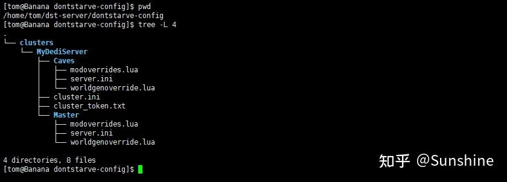

# 饥荒联机版

## 饥荒联机版服务器搭建（Linux）

### 1. Bohrium 上创建一个容器节点

机型：2 核 4GB
镜像：ubuntu:22.04-py3.10

### 2. 配置更新源

```bash
add-apt-repository multiverse
dpkg --add-architecture i386
apt-get -y update
```

### 3. 安装依赖

```bash
apt-get -y install lib32gcc-s1 libstdc++6:i386 libgcc1:i386 libcurl4-gnutls-dev:i386
```

### 4. 安装 SteamCMD

```bash
# 创建文件夹
cd ~
mkdir -p dst-server/steamcmd

# 安装 steamcmd 程序
cd ~/dst-server/steamcmd/
curl -sqL "https://steamcdn-a.akamaihd.net/client/installer/steamcmd_linux.tar.gz" | tar zxvf -

# 执行安装程序，安装完毕输入 quit 退出
./steamcmd.sh
```

### 5. 安装饥荒服务端

```bash
# 创建游戏安装文件夹
cd ~
mkdir -p dst-server/dontstarve

# 安装游戏
~/dst-server/steamcmd/steamcmd.sh +force_install_dir ~/dst-server/dontstarve +login anonymous +app_update 343050 validate +quit
```

### 6. 创建服务配置

- Steam 账号登陆[科雷官网](https://link.zhihu.com/?target=https%3A//accounts.klei.com/login)


- 登录之后选择【游戏】-【《饥荒：联机版》的游戏服务器】


- 添加新服务器，输入【你的服务器名称】，然后点击【添加服务器】


- 添加完成后，选择【配置服务器】


- 输入基础的信息，然后点击【下载设置】


- 下载完成后，得到一个名为“MyDediServer.zip”的压缩文件。解压文件后，文件夹的结构如下：


### 7. 配置服务器

```bash
# 创建游戏配置文件夹
cd ~
mkdir -p dst-server/dontstarve-config/clusters

# 上传配置文件并解压
cd dst-server/dontstarve-config/clusters
unzip MyDediServer.zip

```

解压之后的目录结构如下所示：


【cluster.ini】：集群的配置

【cluster_token.txt】：服务器 token

【Caves】:洞穴相关的配置

【Master】：地面相关配置

### 8. 添加 Mod

- 准备一个 mods 文件，里面存放内容如下（第一列表示是否启用该 mod，第二列表示 mod 的创意工坊地址，第三列代表 mod 的名称）：

```bash
1, https://steamcommunity.com/sharedfiles/filedetails/?id=1998081438, 掉落堆叠(Drop & Stack)
1, https://steamcommunity.com/sharedfiles/filedetails/?id=1898292532, [Tips]提示猎狗和BOSS的攻击时间
1, https://steamcommunity.com/sharedfiles/filedetails/?id=1595631294, Smart Minisign
1, https://steamcommunity.com/sharedfiles/filedetails/?id=661253977, Don't Drop Everything
1, https://steamcommunity.com/sharedfiles/filedetails/?id=1207269058, Simple Health Bar DST
1, https://steamcommunity.com/sharedfiles/filedetails/?id=1530801499, Fast Travel (GUI)
0, https://steamcommunity.com/sharedfiles/filedetails/?id=2398672953, [DST]Musha 完整版
1, https://steamcommunity.com/sharedfiles/filedetails/?id=727774324, Craft Pot [DS, ROG, SW, DST]
1, https://steamcommunity.com/sharedfiles/filedetails/?id=347079953, Display Food Values
0, https://steamcommunity.com/sharedfiles/filedetails/?id=2881739960, Smart Minisign Revisited
1, https://steamcommunity.com/sharedfiles/filedetails/?id=1185229307, Epic Healthbar
1, https://steamcommunity.com/sharedfiles/filedetails/?id=501385076, Quick Pick
1, https://steamcommunity.com/sharedfiles/filedetails/?id=764204839, Automatic Health Adjust
1, https://steamcommunity.com/sharedfiles/filedetails/?id=800210142, Beefalo information
1, https://steamcommunity.com/sharedfiles/filedetails/?id=1120124958, Boss Indicators
1, https://steamcommunity.com/sharedfiles/filedetails/?id=758532836, Global Pause
1, https://steamcommunity.com/sharedfiles/filedetails/?id=462434129, Restart
1, https://steamcommunity.com/sharedfiles/filedetails/?id=374550642, Increased Stack size
1, https://steamcommunity.com/sharedfiles/filedetails/?id=345692228, Minimap HUD
1, https://steamcommunity.com/sharedfiles/filedetails/?id=358749986, Extended Indicators WIP
1, https://steamcommunity.com/sharedfiles/filedetails/?id=362175979, Wormhole Marks [DST]
1, https://steamcommunity.com/sharedfiles/filedetails/?id=666155465, Show Me (Origin)
1, https://steamcommunity.com/sharedfiles/filedetails/?id=378160973, Global Positions
0, https://steamcommunity.com/sharedfiles/filedetails/?id=458587300, Fast Travel
1, https://steamcommunity.com/sharedfiles/filedetails/?id=375850593, Extra Equip Slots
1, https://steamcommunity.com/sharedfiles/filedetails/?id=367546858, Chinese Language Pack（中文语言包）
0, https://steamcommunity.com/sharedfiles/filedetails/?id=565979581, Minimap HUD
1, https://steamcommunity.com/sharedfiles/filedetails/?id=351325790, Geometric Placement
1, https://steamcommunity.com/sharedfiles/filedetails/?id=376333686, Combined Status

```

- 执行脚本生成 `dedicated_server_mods_setup.lua` 和 `modoverrides.lua` 文件

```python
import os

with open("mods", "r") as f:
    mods = f.readlines()

enabled_mods = [[line.split(",")[1].split("?id=")[1], line.split(",")[2].strip()] for line in mods if line.split(",")[0]=='1']

header = """--There are two functions that will install mods, ServerModSetup and ServerModCollectionSetup. Put the calls to the functions in this file and they will be executed on boot.

--ServerModSetup takes a string of a specific mod's Workshop id. It will download and install the mod to your mod directory on boot.
        --The Workshop id can be found at the end of the url to the mod's Workshop page.
        --Example: http://steamcommunity.com/sharedfiles/filedetails/?id=350811795
        --ServerModSetup("350811795")

--ServerModCollectionSetup takes a string of a specific mod's Workshop id. It will download all the mods in the collection and install them to the mod directory on boot.
        --The Workshop id can be found at the end of the url to the collection's Workshop page.
        --Example: http://steamcommunity.com/sharedfiles/filedetails/?id=379114180
        --ServerModCollectionSetup("379114180")"""

with open("dedicated_server_mods_setup.lua", "w") as f:
    f.write(header)
    for mod in enabled_mods:
        f.write('ServerModSetup("%s") --%s\n' % (mod[0], mod[1]))

os.system('chmod 755 dedicated_server_mods_setup.lua')


with open("modoverrides.lua", "w") as f:
    f.write("return{\n")
    for mod in enabled_mods:
        f.write('["workshop-%s"]={ configuration_options={  }, enabled=true },\n' % mod[0])
    f.write("}\n")
```

- 将 `dedicated_server_mods_setup.lua` 文件复制到 `~dst-server/dontstarve/mods`

- 将 `modoverrides.lua` 文件复制到 `～/dst-server/dontstarve-config/clusters/{存档名字}/Master` 和 `～/dst-server/dontstarve-config/clusters/{存档名字}/Caves`

### 9. 启动游戏服务器

- 在 `~/dst-server` 目录下创建游戏启动脚本 `run_server.sh`

```bash
#!/bin/bash

# 以下需要替换为你自己的路径
game_home=/opt/dst-server/dontstarve
game_config_dir=/opt/dst-server/dontstarve-config
game_log_path=/opt/dst-server/log

cluster=$1
if [ -z $cluster ];then
    echo "指定一个存档"
    exit -1
fi

if [ ! -d "/opt/dst-server/dontstarve-config/clusters/$cluster" ]; then
    echo "Directory does not exist"
    exit -1
fi

# Update dontstarve
/opt/dst-server/steamcmd.sh +force_install_dir /opt/dst-server/dontstarve +login anonymous +app_update 343050 validate +quit

# 定义要启动的shard列表
shards=("Master" "Caves")

# 遍历并启动每个shard
for shard in "${shards[@]}"; do
    if [[ "$shard" == "Master" ]]; then
        echo "启动地面服务器"
    elif [[ "$shard" == "Caves" ]]; then
        echo "启动洞穴服务器"
    fi

    cd "$game_home"/bin
    run_command=(./dontstarve_dedicated_server_nullrenderer)
    run_command+=(-console)
    run_command+=(-persistent_storage_root "$game_config_dir")
    run_command+=(-conf_dir clusters)
    run_command+=(-cluster "$cluster")
    run_command+=(-shard "$shard")

    mkdir -p "$game_log_path"
    time=`date +"%Y%m%d_%H%M%S"`
    "${run_command[@]}" >"$game_log_path"/log_${time}_$shard.log 2>&1 &
done

echo "已启动地面和洞穴服务器"
```

- 启动服务器

```bash
chmod +x run_server.sh
./run_server.sh {存档名字}
```

### 10. 停止服务器

```bash
ps -ef | grep dontstarve
kill -9 <PID>

```

### 参考资料

- [饥荒联机版专用服务器搭建教程（二）【Linux 篇】](https://zhuanlan.zhihu.com/p/1896332482762236476)
