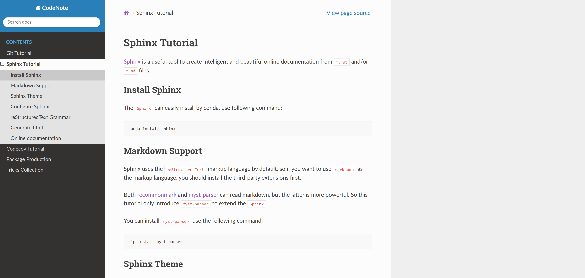

# Sphinx Tutorial

[Sphinx](https://www.sphinx-doc.org/en/master/) is a useful tool to create intelligent and beautiful online documentation from `*.rst` and/or `*.md` files.

## Install Sphinx

The `Sphinx` can easily install by conda, use following command:

```
conda install sphinx
```

## Markdown Support

Sphinx uses the `reStructuredText` markup language by default, so if you want to use `markdown` as the markup language, you should install the third-party extensions first.

Both [recommonmark](https://recommonmark.readthedocs.io/en/latest/) and [myst-parser](https://myst-parser.readthedocs.io/en/latest/) can read markdown, but the latter is more powerful. So this tutorial only introduce `myst-parser` to extend the `Sphinx`.

You can install `myst-parser` use the following command:

```
pip install myst-parser
```

## Sphinx Theme

When you generate the `*.html` from sphinx, the default web theme is not very beautiful, so if you want to decorate the web page, you can change the default theme of sphinx, but should install theme extensions first.

Following this command:

```
pip install sphinx_rtd_theme
```

The `sphinx_rtd_theme` will install and can be used by sphinx. This theme looks like this:

<div align=center></div>

## Configure Sphinx

Quick start a sphinx project is very easy, only need run the following command:

```
sphinx-quickstart
```

then following the introduction to complete the initial configuration.

Before we start the write the documentation, we need to configure the sphinx and extensions at first, and only `conf.py` file need to modify (locate in `/source` directory), like this.

```python
# Configuration file for the Sphinx documentation builder.
#
# This file only contains a selection of the most common options. For a full
# list see the documentation:
# https://www.sphinx-doc.org/en/master/usage/configuration.html

# -- Path setup --------------------------------------------------------------

# If extensions (or modules to document with autodoc) are in another directory,
# add these directories to sys.path here. If the directory is relative to the
# documentation root, use os.path.abspath to make it absolute, like shown here.
#

# -- Project information -----------------------------------------------------

project = 'CodeNote'
copyright = '2022, hui_zhou'
author = 'hui_zhou'

# The full version, including alpha/beta/rc tags
release = '0.0.1'


# -- General configuration ---------------------------------------------------

# Add any Sphinx extension module names here, as strings. They can be
# extensions coming with Sphinx (named 'sphinx.ext.*') or your custom
# ones.
extensions = ['sphinx.ext.autodoc', 'sphinx.ext.viewcode', 'myst_parser']

myst_enable_extensions = [
    "amsmath",
    "colon_fence",
    "deflist",
    "dollarmath",
    "fieldlist",
    "html_admonition",
    "html_image",
    "linkify",
    "replacements",
    "smartquotes",
    "strikethrough",
    "substitution",
    "tasklist",
]

# Add any paths that contain templates here, relative to this directory.
templates_path = ['_templates']

# List of patterns, relative to source directory, that match files and
# directories to ignore when looking for source files.
# This pattern also affects html_static_path and html_extra_path.
exclude_patterns = []


# -- Options for HTML output -------------------------------------------------

# The theme to use for HTML and HTML Help pages.  See the documentation for
# a list of builtin themes.
#
source_suffix = ['.rst', '.md', '.MD']

html_theme = 'sphinx_rtd_theme'

# Add any paths that contain custom static files (such as style sheets) here,
# relative to this directory. They are copied after the builtin static files,
# so a file named "default.css" will overwrite the builtin "default.css".
html_static_path = ['_static']
```

Where `extensions` list the extensions we need to enable, `myst_enable_extensions` specify the extensions belonging to `myst-parser`, `source_suffix` list the documentation file suffix and `html_theme` specify the theme what we use.

:::{note}
If you also list the `linkify` in the `myst_enable_extensions`, please install `myst-parser[linkify]` first.
:::

## reStructuredText Grammar

The rst grammar can see [here](https://ebf-contribute-guide.readthedocs.io/zh_CN/latest/rest-syntax/base-syntax.html), which is not the main content of this tutorial.

## Generate html

After you finish the documentation, you can run the following command (in `/docs` directory) to generate the `*.html` and preview.

```
make html
```

## Online documentation

If you want to make your documentation online, you can use [github](https://github.com/) and [readthedocs](https://readthedocs.org/) to manage.

Following this steps:

1. prepare a `.readthedocs.yaml` in your `root directory`

2. push your documentation to `github`

3. link your `github` project to `readthedocs`

`.readthedocs.yaml` example:

```yaml
# .readthedocs.yaml
# Read the Docs configuration file
# See https://docs.readthedocs.io/en/stable/config-file/v2.html for details

# Required
version: 2

# Set the version of Python and other tools you might need
build:
  os: ubuntu-20.04
  tools:
    python: "3.9"
    # You can also specify other tool versions:
    # nodejs: "16"
    # rust: "1.55"
    # golang: "1.17"

# Build documentation in the docs/ directory with Sphinx
sphinx:
  configuration: docs/source/conf.py
# If using Sphinx, optionally build your docs in additional formats such as PDF
# formats:
#    - pdf

# Optionally declare the Python requirements required to build your docs
# python:
#   install:
#     - requirements: requirements.txt
#     - method: setuptools
#       path: .
```
